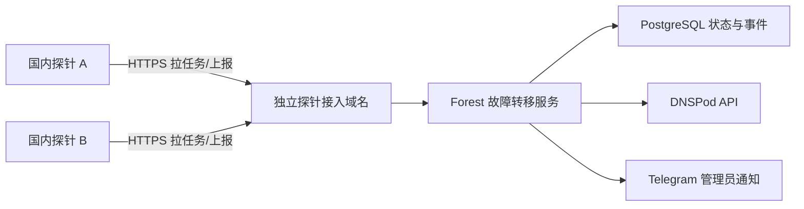

# DNS 备用监控与国内 TCP 探针设计

## 目标

在现有 DNSPod 域名解析管理中增加自动故障转移。管理员为一条 DNS 记录配置多个有序目标，每个目标可以独立使用 `A`、`AAAA` 或 `CNAME`，并指定 TCP 检测地址和端口。国内独立探针主动拉取任务、执行 TCP Connect 并上报结果；面板集中判定健康状态、修改 DNSPod、自动回切并发送 Telegram 通知。

## 已确认的行为

- 目标按排序升序选择，始终使用所有可用目标中优先级最高的一台。
- 主目标故障后自动切到下一台健康目标；高优先级目标恢复稳定后自动回切。
- 两台探针都在线时，必须结果一致才允许切换或回切。
- 任意一台探针失联时，该探针退出本轮决策，以剩余在线探针为标准。
- 全部绑定探针失联时保持当前 DNS，不执行自动操作并发送告警。
- 双探针默认连续失败 3 次、连续成功 6 次；单探针降级模式默认失败 5 次、成功 8 次。
- 探针重新上线后预热 3 次有效上报再重新加入一致性判定。
- 支持 `A -> CNAME -> A` 等跨类型切换；DNS 类型属于目标，不属于规则的固定属性。
- 探针二进制不放 GitHub release，由面板服务器编译并通过单独配置的探针接入域名分发。

## 架构

探针只持有自身随机 Token，不保存 DNSPod 凭证。所有 DNS 修改和决策都在面板执行。探针域名只暴露安装、下载、心跳、任务和结果接口，不暴露管理后台。

## 数据模型

### `v2_dns_probe`

保存探针名称、Token 哈希、启用状态、版本、架构、公网 IP、最后心跳、预热次数和时间戳。Token 仅创建时返回一次。

### `v2_dns_failover_group`

保存 DNSPod 域名 ID、域名、记录 ID、主机记录、线路 ID/名称、TTL、当前目标、启用状态、自动回切、检测间隔、TCP 超时、双/单探针失败与恢复阈值、探针失联阈值、冷却时间以及最后切换信息。

### `v2_dns_failover_target`

保存目标排序、显示名称、DNS 类型、DNS 值、检测主机、检测端口、启用状态。`dns_type` 限制为 `A`、`AAAA`、`CNAME`。CNAME 检测时探针解析目标域名并尝试所有地址，任意一个 TCP 连接成功即为成功。

### `v2_dns_failover_group_probe`

规则与探针多对多绑定。

### `v2_dns_probe_target_state`

保存每个探针对每个目标的最后结果、延迟、错误、连续成功/失败次数、最后上报时间和预热状态。

### `v2_dns_failover_event`

保存故障、结果不一致、探针失联、切换、回切、DNSPod 失败和手动操作，供后台查看与通知去重。

## 探针协议

- `GET /api/v1/probe/install.sh`：生成 systemd 安装脚本。
- `GET /api/v1/probe/download/{os}/{arch}`：下载面板服务器本地编译的二进制。
- `POST /api/v1/probe/heartbeat`：更新版本、架构、IP 和心跳。
- `GET /api/v1/probe/tasks`：按绑定关系返回目标、端口、超时和间隔。
- `POST /api/v1/probe/results`：批量上报 TCP 结果。

探针使用 `Authorization: Bearer <token>`。数据库保存 SHA-256 哈希，接口使用恒定时间比较。任务和结果都带稳定 ID，重复上报保持幂等。

## 判定状态机

面板收到结果后更新连续计数，并在数据库事务中锁定规则：

1. 只使用心跳未过期且预热完成的绑定探针。
2. 两台及以上在线时要求所有在线探针对目标达到相同阈值。
3. 仅一台在线时使用单探针阈值。
4. 当前目标被一致判定故障后，从排序最前的健康目标开始选择。
5. 当前目标正常时，如更高优先级目标达到恢复阈值且启用自动回切，则回切。
6. 冷却期内不执行新的自动切换。
7. 更新 DNSPod 成功后提交当前目标；失败则保留旧状态并记录事件。

## Telegram 通知

复用现有 `NotifyAdmins` 和 `send_telegram` 队列。通知包括规则、原目标、新目标、DNS 类型变化、端口、参与探针、失败/恢复次数、实际连接 IP、DNSPod 结果和时间。相同状态只在首次出现、持续超时提醒和恢复时通知，避免每轮刷屏。

## 后台页面

在“域名解析”中增加“备用监控”和“探针管理”视图：

- 规则列表：记录、当前目标、运行状态、在线探针、最近切换、开关和手动切换。
- 规则编辑：选择现有 DNS 记录，配置阈值和绑定探针，拖动目标排序。
- 目标编辑：DNS 类型/值、检测主机、端口和名称。
- 探针管理：接入地址、创建探针、安装命令、心跳、版本、吊销和事件。
- 事件明细：检测结果、切换原因、DNSPod 错误和 Telegram 状态。

## 二进制分发

`scripts/appctl build` 在服务器构建主程序后交叉编译 `forest-probe` 的 Linux amd64/arm64 版本，存入 `storage/probe/` 并生成 SHA256。探针接入地址单独配置，例如 `https://probe.example.com`。安装脚本从该地址下载、校验、写入 `/etc/forest-probe/config.json` 并安装 `forest-probe.service`。
